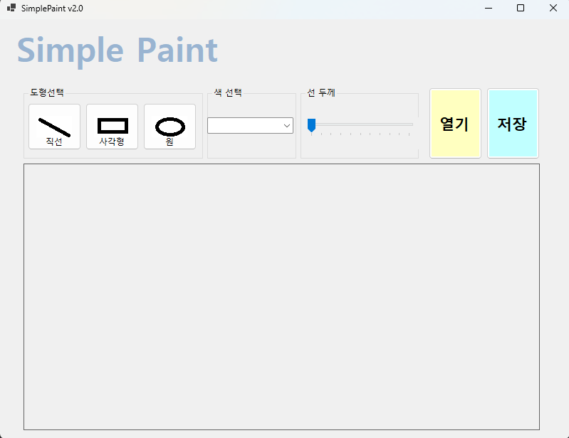
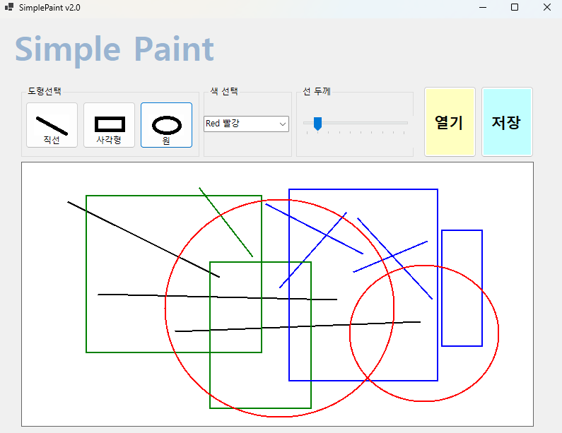
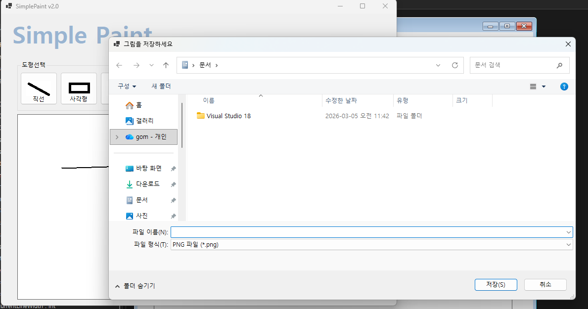

# (C# 코딩) SimplePaint

## 개요
- C# 프로그래밍 학습
- 1줄 소개: 직선, 사각형, 원을 그릴 수 있는 간단한 프로그램

- 사용한 플랫폼: 
	- C#, .NET Windows Forms, Visual Studio, GitHub

- 사용한 컨트롤:
	- Label, ComboBox, TrackBar, Button, GroupBox, PictureBox

- 사용한 기술과 구현한 기능:
	- Visual Studio를 이용하여 UI 디자인
	- PictureBox 컨트롤을 사용하여 도형 그리기 구현
	- Button에 사진을 넣어 도형 선택 기능 구현
	- TrackBar를 이용하여 선 굵기 조절 기능 구현

## 실행 화면 (과제1)
- 1단계 코드의 실행 스크린샷

- 구현한 내용 (위 그림 참조)
	- UI구성 : Label, ComboBox, TrackBar, Button, GroupBox, PictureBox를 통해 도형 선택, 색선택, 선굵기 조절, 그리기 기능 구현
	- 도형 그리기 : 직선, 사각형, 원을 그릴 수 있도록 구현
	- 도형 선택 : Button을 통해 도형 선택 기능 구현
	- 선 굵기 조절 : TrackBar를 이용하여 선 굵기 조절 기능 구현

## 실행 화면 (과제2)
- 2단계 코드의 실행 스크린샷

- 구현한 내용 (위 그림 참조)
	- 기능구현 : 도형 그리기, 선 굵기 조절, 도형 선택 기능 구현
	- Paint 이벤트 핸들러를 이용하여 PictureBox에 도형 그리기 구현
	- 변수 초기화 : 도형의 시작점과 끝점을 저장하는 변수 초기화
	- 이벤트 핸들러 구현 : MouseDown, MouseMove, MouseUp 이벤트 핸들러를 구현하여 도형 그리기 기능 완성
	- 미리보기 기능 : MouseMove 이벤트 핸들러에서 도형의 미리보기 기능 구현

## 실행 화면 (과제3)
- 3단계 코드의 실행 스크린샷

- 구현한 내용 (위 그림 참조)
	- 파일 저장 기능 : SaveFileDialog를 이용하여 그려진 그림을 파일로 저장하는 기능 구현
	- 다중 형식 지원 : PNG, JPG, BMP 3가지 이미지 형식으로 저장 가능
	- 저장 버튼 이벤트 : btnSaveFile 버튼 클릭 시 파일 저장 대화상자 표시
	- 이미지 포맷 처리 : 파일 확장자에 따라 적절한 ImageFormat 선택하여 저장
	- 오류 처리 : 저장 과정에서 발생한 오류를 사용자에게 메시지 박스로 알림
	- 사용자 피드백 : 저장 완료/실패 메시지를 통해 사용자에게 결과 전달

## 실행 화면 (과제4)
- 4단계 코드의 실행 스크린샷

- 구현한 내용 (위 그림 참조)
	- 외부 이미지 파일 열기 : OpenFileDialog를 이용하여 PNG, JPG, BMP, GIF 파일 로드
	- 캔버스 동적 크기 조정 : 로드된 이미지 크기에 맞춰 캔버스(PictureBox) 크기 자동 조정
	- 자동 스크롤바 : 이미지 크기가 큰 경우 자동으로 스크롤바 활성화
	- 확대/축소 기능 : 마우스 휠로 0.1배 ~ 5배 범위 내에서 실시간 확대/축소
	- 그려진 그림 저장 : 확대/축소된 이미지 상태 그대로 PNG, JPG, BMP 형식으로 저장 가능
	- 이미지 품질 유지 : SmoothingMode를 AntiAlias로 설정하여 확대/축소 시 높은 화질 유지